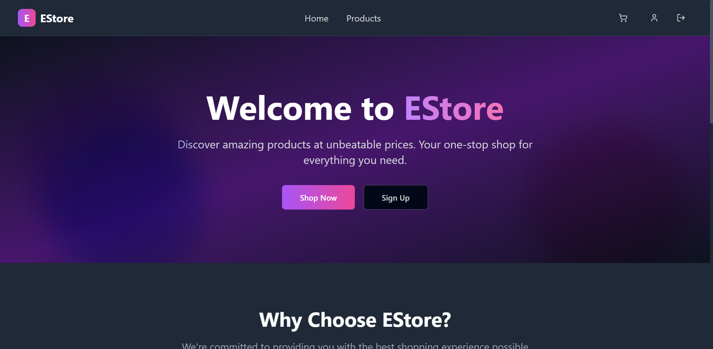
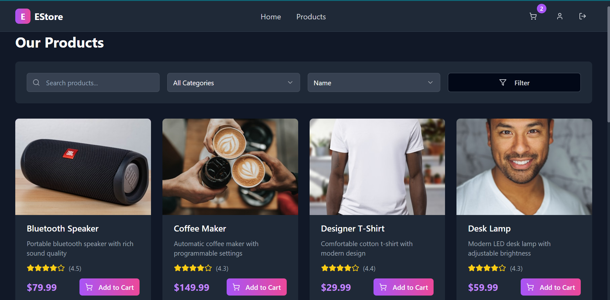
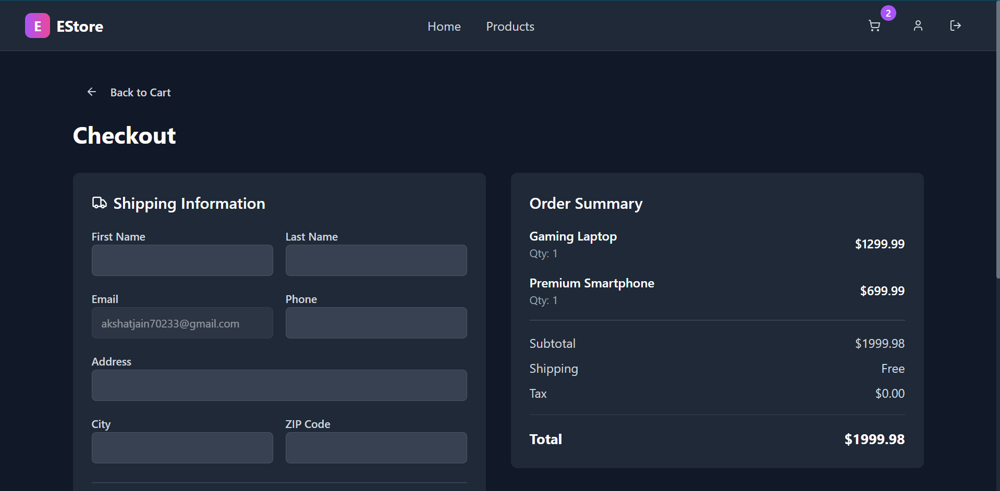
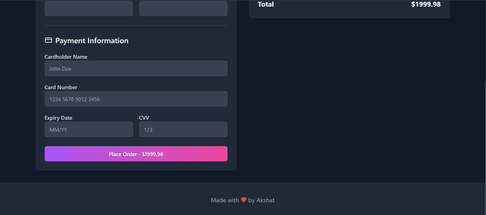
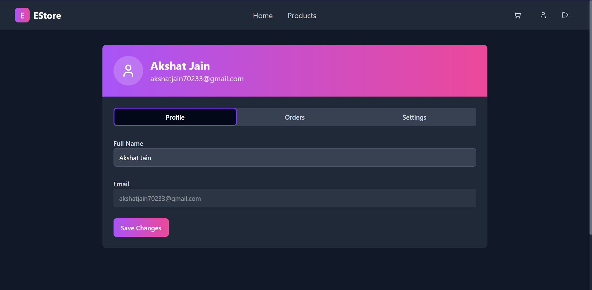

# EStore - E-commerce Platform 🛍️

This project is a full-featured e-commerce platform, **EStore**, built with **React** ⚛️, **TypeScript** 📜, and **Tailwind CSS** 🎨, leveraging **Supabase** 🚀 for the backend. It offers a seamless shopping experience from product Browse to secure checkout and receipt generation.

---

## Features ✨

* **User Authentication (Supabase Powered):** Secure user registration, sign-in, and password recovery. 🔐
* **Product Management (Supabase Powered):** Extensive product listings with advanced filters and powerful search functionality. 🔍
* **Shopping Cart:** A user-friendly system for managing selected items. 🛒
* **Checkout & Payments:** An integrated checkout page with a dummy payment portal using **Razorpay Test Mode**. 💳
* **Receipt Generation:** Downloadable PDF receipts 📄, with the added bonus of automatic email delivery to registered users for easy transaction tracking. 📧
* **Responsive UX Design:** Ensures a seamless Browse experience across all devices. 📱💻🖥️

---

## Screenshots 📸

Here are some screenshots showcasing **EStore**'s user interface:

### Home Page

### Product Listing Page

### Cart Page

### Checkout Page

### User Profile Page

---

## Usage 🧑‍💻

Here's how to use the **EStore** application:

1.  **Register a new account:** Create your EStore account on the registration page. 📝
2.  **Browse products:** Explore the home or product listing pages to find items you like. 👀
3.  **Add to cart:** Click "Add to Cart" for any desired products. ➕
4.  **View cart:** Review your selected items on the cart page. 🛒
5.  **Proceed to checkout:** Initiate the checkout process from your cart. ▶️
6.  **Dummy payment:** Complete your purchase using the integrated dummy payment portal (Razorpay Test Mode). ✅
7.  **Download receipt:** After a successful checkout, you can download your PDF receipt. 📥
8.  **Check email:** Registered users will receive a transaction receipt in their email inbox (bonus feature). 📧
